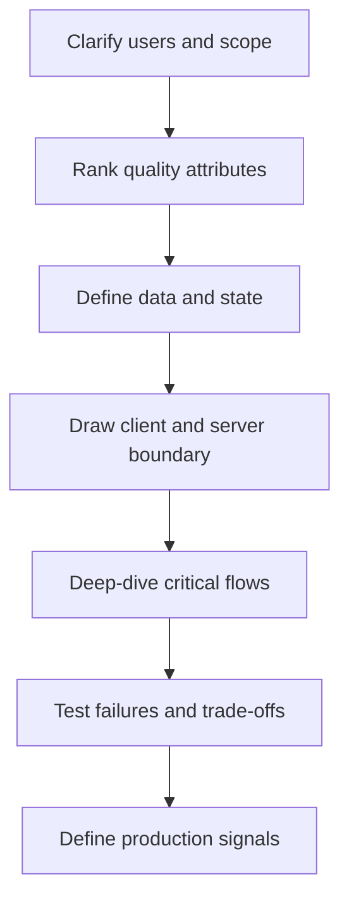
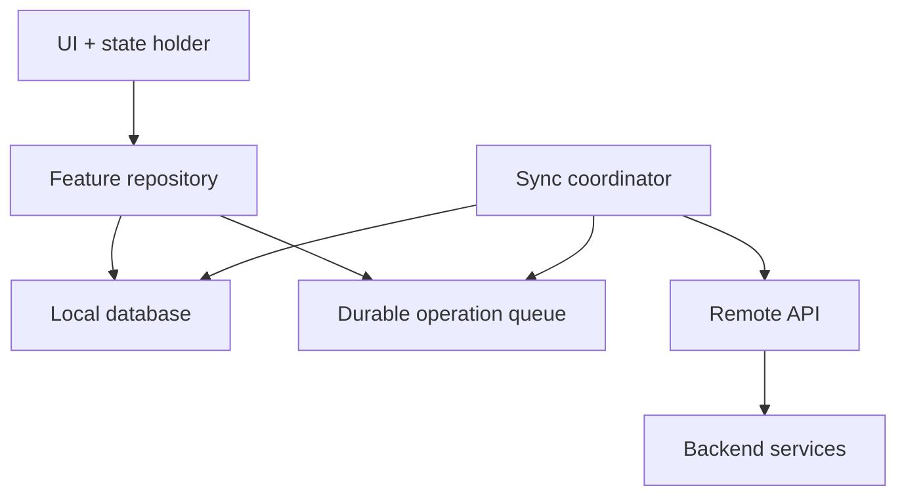

# The Mobile System-Design Interview

The interviewer is not testing whether you memorized Instagram’s source code.
They are testing whether you can turn an ambiguous product into a reasoned,
operable client architecture.

## A repeatable sequence



## Step 1: Narrow the product

Ask questions that change the design:

- Is this one-to-one chat, group chat, or both?
- Must messages work offline?
- Is delivery order required per conversation or globally?
- What is the largest supported attachment?
- Does the app support several signed-in accounts?
- Is end-to-end encryption required?
- Is the target global consumer scale or one enterprise?
- Which platforms are in scope?

Avoid spending five minutes collecting facts that will never affect a
decision. State sensible assumptions and move.

## Step 2: Rank non-functional requirements

Do not say that everything is “highly scalable, secure, reliable, and fast.”
Force an ordering.

For a ride-tracking screen:

1. location freshness;
2. graceful behaviour through short disconnections;
3. battery efficiency;
4. visual smoothness;
5. historical completeness.

For a banking transfer:

1. correctness and duplicate prevention;
2. security and auditability;
3. clear indeterminate-state recovery;
4. availability;
5. perceived speed.

The order determines the architecture. A payment app should not turn a timeout
into a blind retry. A social “like” can usually use optimistic UI and reconcile
later.

## Step 3: Estimate the client workload

Backend interviews estimate global requests per second. Mobile interviews also
estimate per-device cost:

- records visible in one screen;
- records cached locally;
- daily data transfer;
- average and worst-case media size;
- update frequency;
- database growth over months;
- number of concurrent operations;
- foreground and background duration;
- acceptable startup and interaction latency.

Example for a photo feed:

```text
20 cards/page × 200 KiB thumbnail ≈ 4 MiB/page
5 pages/session × 3 sessions/day ≈ 60 MiB/day before caching
```

The estimate immediately creates design questions: thumbnail variants, next
page prefetch, cellular policy, disk cache budget, and eviction.

## Step 4: Define durable state before drawing layers

List the main entities and their lifecycle:

```text
FeedItem(id, authorId, revision, createdAt, ...)
Media(id, remoteUrl, localPath?, dimensions, transferState)
PendingAction(clientOperationId, kind, payload, attempt, state)
SyncCursor(stream, value, updatedAt)
```

Ask:

- Which state must survive process death?
- Which state is authoritative locally?
- Which values are server assigned?
- Which operations may be replayed?
- What represents “pending,” “failed,” or “unknown”?

This is more useful than starting with boxes labelled ViewModel and Repository.

## Step 5: Draw the minimum high-level design



Explain the arrows:

- UI observes local state.
- User intent creates a local mutation and, when necessary, a durable pending
  operation.
- A sync coordinator sends eligible operations.
- Server responses update local state.
- The UI does not wait on a fragile network round trip to reconstruct state.

Not every app needs this architecture. A small weather app might simply use a
memory cache plus REST. Complexity must be purchased by a requirement.

## Step 6: Deep-dive the risky flows

Choose two or three:

- interrupted attachment upload;
- reconnect after being offline for three days;
- duplicate payment submission;
- opening a feed from cold start;
- editing the same note on two devices;
- receiving a message while the process is dead;
- API schema evolution with old binaries installed.

For each flow, narrate:

1. happy path;
2. transient failure;
3. process death;
4. duplicate or out-of-order event;
5. permanent failure;
6. what the user sees;
7. what production telemetry records.

## Step 7: Make trade-offs explicit

Weak:

> I would use GraphQL because mobile needs smaller responses.

Stronger:

> The home surface composes data owned by several backend domains and changes
> frequently. GraphQL lets the client request the fields needed by each
> version, but introduces query-cost controls, normalized-cache complexity,
> and another schema layer. If the screen has a stable payload and one backend
> owner, a versioned REST endpoint or mobile BFF is simpler.

## Step 8: Close with operation, not architecture theatre

Name the signals:

- cold-start p50/p95 by device class;
- screen load-to-content;
- cache hit rate;
- sync queue age;
- retry count and terminal failures;
- duplicate-operation rejection;
- crash-free sessions and ANR/hang rate;
- upload success by file size and network type;
- battery or background wake-up regressions;
- API errors segmented by app version.

## A 60-second opening

> I’ll first clarify the users, critical journeys, and scale. Then I’ll rank the
> mobile quality attributes because reliability, latency, battery, and offline
> behaviour will drive different choices. I’ll define the client’s durable
> state, draw the client/server boundary, and then deep-dive the two hardest
> flows. I’ll finish with failure handling, security, observability, and the
> trade-offs of the alternatives.

## Common failure modes in the interview

- Starting with a technology rather than a requirement.
- Reproducing a generic backend diagram and barely discussing the client.
- Saying “cache it” without freshness, invalidation, size, and ownership.
- Saying “offline-first” without a write queue and conflict strategy.
- Saying “retry” without idempotency, limits, or error classification.
- Assuming a background socket remains alive when the OS kills the app.
- Treating a timeout as failure when the server may have committed the action.
- Ignoring old installed binaries during API evolution.
- Listing alternatives without choosing one.
- Never describing what the user sees during uncertainty.

