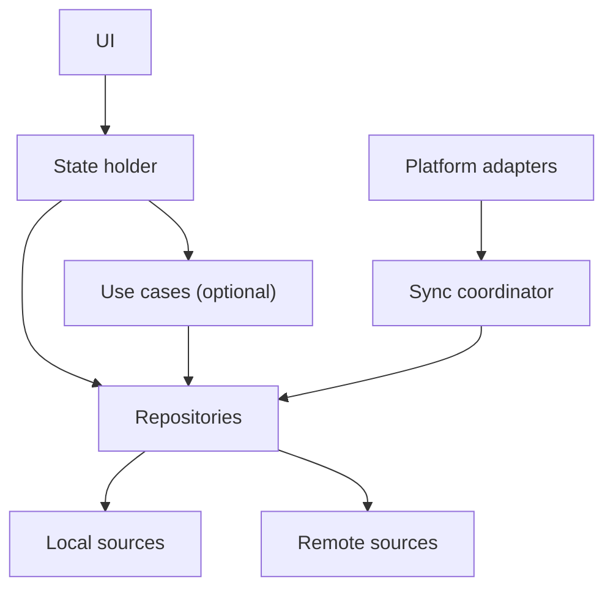

# Client Architecture at Scale

Architecture determines where decisions live, how state flows, and how teams
change the system safely. Pattern names are secondary.

## Begin with responsibilities

A scalable client commonly needs:

- **UI rendering:** maps state to pixels and accessibility semantics;
- **state holder:** owns screen state and processes user events;
- **domain policy:** reusable business rules when complexity justifies it;
- **repository:** owns a business data type across data sources;
- **local data source:** database, files, or preferences;
- **remote data source:** protocol and DTO handling;
- **sync coordinator:** schedules and reconciles durable work;
- **platform adapters:** permissions, notifications, background tasks, sensors;
- **observability:** traces important transitions without leaking private data.

## A pragmatic layered architecture



Dependency direction protects business policy from UI and transport details.
It does not require one class for every arrow.

## MVVM, MVI, and unidirectional data flow

### MVVM

Useful when screen state can be exposed by a state holder and user actions map
to clear methods. It is familiar on Android and iOS variants.

Risks:

- state split across many observable properties;
- invisible event ordering;
- two-way binding creating unclear ownership;
- ViewModels becoming feature-wide service locators.

### MVI/reducer-style state

Events produce a new immutable state, often through reducers:

```text
State + Intent → Result/Effect → New State
```

Useful for complex state transitions, reproducibility, and debugging.

Costs:

- ceremony for simple screens;
- accidental giant state objects;
- one-off effects such as navigation need a deliberate model;
- naive copying can be expensive, though persistent/structurally shared data
  structures and scoped state reduce the cost.

### Decision

Use the smallest state model that makes transitions explicit. Consistency
across a large organization may be more valuable than choosing the theoretically
perfect pattern per screen.

## Is a domain layer necessary?

Use cases are valuable when:

- rules combine several repositories;
- a policy is reused across screens or platforms;
- the same action can be triggered by UI and background work;
- authorization or validation must not be bypassed;
- the rule deserves focused tests.

Skip pass-through use cases that only rename a repository call. Android’s
official architecture guidance also describes the domain layer as optional.

## Repository: what it should mean

A repository is not merely an API wrapper. It owns access and mutation policy
for a business concept.

```kotlin
interface NotesRepository {
    fun observeNote(id: NoteId): Flow<Note>
    suspend fun edit(id: NoteId, patch: NotePatch): EditReceipt
    suspend fun refresh(id: NoteId)
}
```

The UI should not decide whether `observeNote` reads Room, memory, or the
network. Nor should it coordinate an outbox transaction.

Repository failure modes:

- one “God repository” for the entire app;
- leaking network DTOs into UI;
- silently swallowing sync errors;
- mixing UI formatting with durable business state;
- exposing both database and network versions and forcing callers to reconcile.

## Feature and layer modularization

### By feature

```text
features/
  feed/
  profile/
  messaging/
platform/
  networking/
  storage/
  observability/
```

Benefits:

- clearer product ownership;
- localized changes;
- potential build parallelism;
- fewer accidental dependencies.

Risks:

- duplicated infrastructure;
- feature-to-feature dependency mesh;
- unclear shared model ownership.

### By technical layer

```text
ui/
domain/
data/
network/
```

Simple initially, but every feature touches every module and ownership becomes
horizontal.

### Hybrid

Large apps commonly benefit from feature modules plus a small set of governed
platform capabilities. Dependency rules should be mechanically checked.

## State has several lifetimes

| State | Example | Appropriate home |
|---|---|---|
| Frame/transient UI | pressed state | UI toolkit |
| Screen state | filters, selected tab | state holder |
| Navigation session | current flow step | navigation state |
| Process-restorable | draft ID, scroll anchor | saved state |
| Durable local business state | note, message, pending upload | database/files |
| Server-authoritative | permissions, settled payment | server plus local projection |

A common production bug is storing durable work only in a ViewModel. Process
death then turns an upload or outgoing message into lost intent.

## Multi-platform choices

### Separate native apps

Best platform integration and independent evolution; highest duplicated effort.

### Shared domain/data code

Kotlin Multiplatform, C++, or Rust can share protocol, cryptography, storage, or
business logic while UIs remain native. This is attractive where consistency is
more important than UI sharing.

Costs include interop boundaries, debugging, build tooling, and shared-core
release coordination.

### Shared UI frameworks

React Native, Flutter, and other frameworks can increase product-code sharing.
Evaluate:

- startup path;
- binary size;
- accessibility;
- platform API lag;
- native escape hatches;
- performance of critical surfaces;
- team skill and ownership;
- upgrade burden.

**Documented — Meta:** Meta has described using React Native for product
surfaces and measuring its cold-start implications, while Facebook and
Instagram also contain substantial native and company-specific infrastructure.
The useful lesson is per-surface measurement, not “React Native is always
native-fast.”

## Architecture fitness functions

Architecture should be enforceable and measurable:

- forbidden module dependency checks;
- API visibility rules;
- build time by module;
- startup ownership and budgets;
- database migration tests;
- contract compatibility tests;
- state-transition tests;
- number of cyclic dependencies;
- percentage of features using the standard observability path.

## Interview answer

> I would use feature-oriented modules with shared networking, storage,
> authentication, and observability capabilities. Each feature exposes a UI
> contract and owns its state holder and repository. The local database is the
> read source for offline-capable data. A domain layer is optional: I add use
> cases only for reusable or cross-repository policy. Durable work belongs in
> storage and a sync coordinator, not in screen lifecycle objects.

