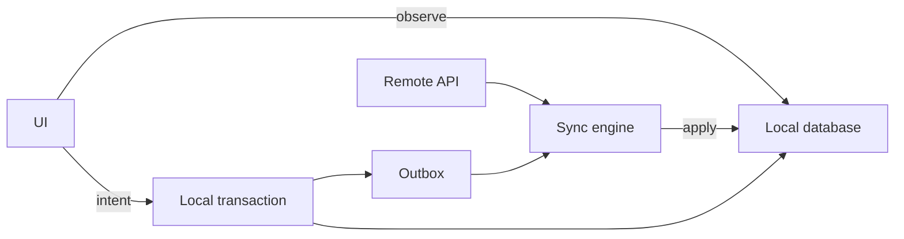

# Local Data, Offline-First, and Synchronization

Offline-first is not “add a cache.” It is a consistency model, write policy,
sync protocol, and user experience.

## Choose the offline level

| Level | Behaviour | Suitable examples |
|---|---|---|
| No offline support | error/empty state without network | rare transactional utility |
| Cached reads | previously seen content is readable | news, profiles |
| Queued simple writes | actions send when online | likes, read markers |
| Full offline editing | create/update/delete locally | notes, field work |
| Collaborative local-first | concurrent multi-device editing | documents, whiteboards |

Do not buy full local-first complexity when cached reads meet the requirement.

## Local database as read source



The UI consistently reads one model. Network responses update the database;
the database notifies observers.

Android’s official offline-first guidance describes the local data source as
the canonical source read by higher layers. On iOS, the same architecture can
be implemented with Core Data, SQLite/GRDB, SwiftData where appropriate, or a
purpose-built store.

## Cache policy

### Cache-first

Show cached data immediately, refresh in the background.

Good for feeds and content where some staleness is acceptable.

### Network-first

Try fresh data, fall back to cache.

Good where freshness matters but offline fallback still helps. It can make the
common path feel slower if the client waits for a network timeout before using
valid cache.

### Stale-while-revalidate

Return cached content immediately and refresh concurrently. Mark or replace it
when fresh data arrives.

### Cache-only/offline download

User explicitly pins content. Eviction policy must distinguish pinned and
reconstructible data.

Define for each dataset:

- key;
- freshness/TTL;
- validation method;
- size budget;
- eviction;
- whether it is safe across accounts;
- whether it contains sensitive data;
- behaviour after schema migration.

## Durable writes with an outbox

For an offline note edit:

```text
1. Generate clientOperationId.
2. In one local transaction:
   - apply the optimistic edit;
   - increment local revision;
   - insert pending operation.
3. UI immediately renders pending state.
4. Sync worker sends operation when constraints permit.
5. Server accepts, rejects, or reports conflict.
6. Client reconciles and marks operation completed or failed.
```

Suggested operation state:

```text
ENQUEUED → RUNNING → ACKNOWLEDGED
                ↘ RETRY_WAIT
                ↘ BLOCKED_CONFLICT
                ↘ FAILED_PERMANENT
```

Persist attempt count, next eligible time, last structured error, and
dependencies. Do not persist secrets unnecessarily.

## Background execution

The operating system, not the app, controls background opportunity.

**Android:** WorkManager is appropriate for persistent, deferrable,
constraint-aware work that should survive process or device restart. It
supports network/charging constraints and backoff. It is not a promise to run
at an exact second.

**iOS:** background `URLSession` supports system-managed file transfers.
`BGTaskScheduler` offers discretionary refresh/processing opportunities.
Design around suspension and relaunch rather than expecting an indefinitely
running process.

Keep enough state to resume safely after any instruction.

## Sync models

### Full snapshot

Fetch all records and replace local projection.

Simple, useful for small bounded datasets. Wasteful and disruptive for large
data.

### Updated-since timestamp

Fetch records changed after a timestamp.

Clock precision, equal timestamps, deletion, and server clock semantics make
this easy to get wrong.

### Cursor/change token

Server returns an opaque cursor with each ordered change page:

```json
{
  "changes": [
    {"sequence": 42, "type": "note.updated", "id": "n1", "revision": 7},
    {"sequence": 43, "type": "note.deleted", "id": "n2"}
  ],
  "nextCursor": "opaque_43",
  "hasMore": false
}
```

Apply a page and save its cursor atomically. If the app dies before commit, it
replays the page safely. Upserts and tombstones must be idempotent.

### Merkle trees/content hashes

Useful for comparing large hierarchies or content-addressed data without
transmitting every item. More complex than a linear change stream.

## Deletions require tombstones

If a deleted record simply disappears from the server, an offline device cannot
know to remove its local copy. A tombstone records identity, deletion revision,
and retention window.

The server retains tombstones long enough for supported offline periods. A
client whose cursor is older than the retention window performs a full resync.

## Conflict detection

### Optimistic concurrency

Client sends the base revision:

```http
PATCH /notes/n1
If-Match: revision-7
```

If the server is now at revision 8, it returns a conflict rather than silently
overwriting.

### Conflict resolution strategies

| Strategy | Works for | Cost/risk |
|---|---|---|
| Server wins | server-owned policy | may discard local intent |
| Client wins | single-user replaceable state | can overwrite newer remote data |
| Last-write-wins | low-value independent state | clocks/order may not reflect intent |
| Field-level merge | disjoint profile/settings edits | same-field conflicts remain |
| Append-only | messages, audit events | edits/deletes need separate semantics |
| User resolution | rare high-value conflicts | interrupts user |
| OT | centralized collaborative text | algorithm and transformation complexity |
| CRDT | concurrent local-first collaboration | metadata and model complexity |

The data type should drive the strategy. A profile avatar can be last-write-wins.
A bank balance cannot. A text document may need semantic collaboration.

## Multiple devices

Give each device and operation a stable ID. Separate:

- user identity;
- device installation identity;
- session;
- client operation identity;
- server entity identity.

Do not use a device clock as the only global ordering authority. Server
revisions or logical clocks are safer.

## Real-world evidence

**Documented — Dropbox:** Dropbox describes sync engines as coordinating local
and remote filesystem state and emphasizes that a clean data model became
critical at enormous file and revision scale. Its published Nucleus article is
about desktop sync; this book uses its invariants as general sync evidence, not
as a claim about Dropbox mobile internals.

**Documented — Dropbox Carousel:** Dropbox described a network-backed mobile
photo app designed to feel local and to represent local and remote photos
together. This is a canonical “local projection of distributed state” problem.

**Observable — Spotify:** downloaded playlists remain playable without a
network connection and later reconcile catalogue/account state. An
interview-grade design would separate pinned media blobs, metadata, entitlement
state, and a sync cursor. This is an illustrative design, not a claim about
Spotify’s private schema.

## Failure checklist

- app dies between local mutation and outbox insertion;
- same operation delivered twice;
- events arrive out of order;
- token expires halfway through sync;
- account changes while work is queued;
- schema migration runs with pending operations;
- tombstone retention expires;
- server accepts write but response is lost;
- permanent error retries forever;
- one poisoned operation blocks the entire queue;
- conflict is silently resolved and loses meaningful work.

